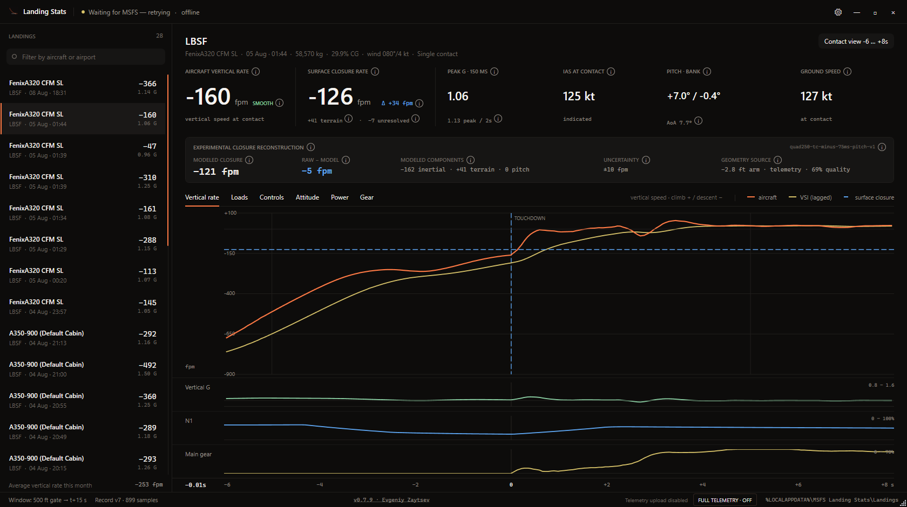

# MSFS 2024 Landing Stats

[](https://github.com/Arderos/msfs24-landing-stats/actions/workflows/build.yml)
[](https://github.com/Arderos/msfs24-landing-stats/releases/latest)




A Windows desktop application that records, analyzes, and visualizes landings in
Microsoft Flight Simulator 2024 through SimConnect.

## Why it is different

Most landing trackers reduce a touchdown to one FPM value without making clear
whether it is the aircraft's actual vertical motion, an indicated VSI value, or
the rate at which the gap to the runway closed. Those values can differ by
hundreds of feet per minute on the same landing.

MSFS Landing Stats keeps the measurements separate and preserves the evidence
behind them:

| | Typical single-number tracker | MSFS Landing Stats |
| --- | --- | --- |
| Landing rate | One FPM value | Aircraft vertical rate and surface closure rate, with explicit signs and definitions |
| Sloped or uneven scenery | Can be folded into the displayed FPM | Local terrain contribution is measured and shown separately |
| Simulator latch differences | Left unexplained | Experimental telemetry reconstruction separates effective timing, terrain, and pitch rotation with an explicit uncertainty band |
| Bounces | Often only the first or last contact survives | Every contact is analyzed and retained as its own event |
| G-load | One value with an unspecified sampling window | Peaks are calculated in declared 150 ms and 2 s windows, bounded by the next contact |
| Evidence | Summary values only | Synchronized black-box traces for motion, loads, controls, power, attitude, and gear |
| Data quality | A number is shown even when its source is ambiguous | Extrapolation, fallback, latch verification, and unavailable data are identified explicitly |
| Ownership | Often cloud-backed | Local, portable landing records; new diagnostic reports are created only after an explicit **Report bug** action |

The result is not a landing score or a structural inspection verdict. It is an
engineering view of what the simulator published, how the result was derived,
and where uncertainty remains. See the [measurement methodology](docs/methodology.md)
for the formulas, timing rules, validation traces, and known limitations. See
the [privacy policy](PRIVACY.md) for Google Drive backup and diagnostic-report
data handling.

## Features

- Automatic recording from the descending 500 ft AGL crossing through rollout.
- Per-contact analysis for normal landings and bounces.
- Automatic nearest-airport resolution that remains available after MSFS exits.
- Inertial vertical speed at contact and the raw MSFS surface-normal touchdown
  velocity remain separate headline measurements.
- Experimental detail reconstructs the raw latch from effective timing, local
  terrain motion, and pitch rotation around a gear arm read from the installed
  flight model when available. Readable wheel indices and per-wheel positions
  are used when they agree with live contact channels; complex or encrypted
  aircraft fall back safely to telemetry-derived gear roles or geometry. The
  result includes the remaining residual and a conservative uncertainty band.
- Vertical, longitudinal, and lateral load-factor graphs.
- Synchronized hover and zoom across flight-path, controls, attitude, engine,
  and landing-gear charts.
- Flight-control inputs and surfaces, engine power and throttles, flare,
  attitude, wind, gear compression, and rollout data.
- Hardware pitch-input capture with automatic source matching when SimConnect
  exposes an aircraft-processed command instead of the pilot's controller axis.
- One-click bug reports that securely bundle the last landing telemetry with
  its calculated results; no full-flight recording mode is exposed in the UI.
- Compact local landing history containing only the data used by the dashboard.
- Optional auto-start with detected Steam or Microsoft Store installations of
  MSFS 2024.
- One-file distribution with signed automatic updates and restart.

The application keeps inertial and surface-relative landing rates separate.
This avoids treating runway slope or local scenery elevation changes as aircraft
vertical motion. A simulator touchdown latch is used only when its update can be
attributed to the current contact; otherwise dependent values are reported as
unavailable while independent terrain measurements are retained.

## Requirements

To run the application:

- Windows 10 or Windows 11;
- Microsoft Flight Simulator 2024.

To build locally:

- .NET SDK 10 or Visual Studio 2022 Build Tools;
- Microsoft Flight Simulator 2024 SDK with the SimConnect SDK installed.

## Build

```powershell
.\build-app.ps1 -MsfsSdkRoot "D:\MSFS 2024 SDK"
```

The resulting user download and standalone update helper are written to:

```text
artifacts\MSFS-Landing-Stats.exe
artifacts\MSFS-Landing-Stats.Updater.exe
```

Download and run `MSFS-Landing-Stats.exe`. Nothing needs to be extracted or
kept beside it. The executable prepares its private runtime under LocalAppData;
the SDK is not required at runtime. The updater executable is downloaded only
when a newer signed version exists.

On the first launch after installing this feature, the app asks whether Landing
Stats should open automatically with MSFS 2024. The choice can be changed later
in Settings, and works with detected Steam and Microsoft Store installations.

## Automated builds

GitHub Actions resolves the current MSFS 2024 Core SDK from Microsoft's public
SDK manifest, extracts and caches only the SimConnect build dependency, and
builds the application on `windows-latest`. Tags matching `v*` publish the
single application executable, a temporary standalone updater, and an
RSA-signed format-3 manifest binding the exact version, names, sizes, and
SHA-256 hashes of both executables.

For an update, the running application first verifies the pinned manifest
signature and updater hash. The verified updater then re-downloads the manifest
from the immutable versioned release URL, repeats signature and self-hash
verification, verifies the package size and SHA-256 while streaming, accepts
only a complete single-file bundle with the signed assembly version, and
confirms both the requesting process and replacement target. After the
application exits, it atomically replaces that one executable with rollback on
failure, restarts the new version, and is removed by that new process. No shell
or script participates in the update.

## Data storage

Landing records are stored under:

```text
%LOCALAPPDATA%\MSFS Landing Stats\Landings
```

Ordinary landing records are never uploaded automatically. Removing a landing
from the local history removes its compact stored record.

After a landing is analyzed, the app retains that one episode's telemetry in
memory until the next landing sequence starts. A **Report bug** button appears
only while that telemetry and its calculated landing result are available.
Pressing it explicitly creates and securely queues a ZIP containing both; no
background bug report is created, and beginning the next approach discards the
unsubmitted in-memory telemetry.

Bug reporting registers an anonymous random installation ID and
Windows-protected public key automatically. No hardware UUID is collected.
Queued reports are written under:

```text
%LOCALAPPDATA%\MSFS Landing Stats\Telemetry Queue
```

The app signs reports with a per-installation private key protected by Windows
and deletes a queue copy only after the server accepts it. Failed reports remain
local for automatic retry. Existing RAW diagnostic captures left by older builds
use the same retry queue only when that user had previously consented to
diagnostic uploads, and may resume automatically at startup. A previous refusal
remains in force and causes no network request. On a new installation, the
uploader stays inactive until **Report bug** is pressed.

The receiver accepts signed, automatically enrolled installations and exact
schema-v5 archives, including user-initiated bug-report bundles with calculated
landing results.
It limits one upload to 16 MiB compressed and 64 MiB expanded, one installation
to 512 MiB per day (counting rejected signed attempts too), one source address
to 1 GiB/day, and all ingress to 4 GiB/day. The retained corpus is capped at
20 GiB while preserving a 2 GiB disk reserve. Automatic enrollment is limited
to 10/source/hour and 1,000 globally/hour; the durable registry is atomically
capped at 100,000 identities and removes stale unreferenced identities after
30 days. Invalid, incomplete, and replay-like files are never added to the
corpus. The receiver checks replay kinematics independently of the client by
requiring recorded position and altitude motion to agree with the reported
flight velocities.
New captures use telemetry schema v5 with the documented 20 numeric contact
points; the parser remains compatible with earlier schema v4 captures. Landing
details use the documented [columnar v7 format](docs/format-v7.md), while v1-v6
record files remain readable.

See [CHANGELOG.md](CHANGELOG.md) for release history.
