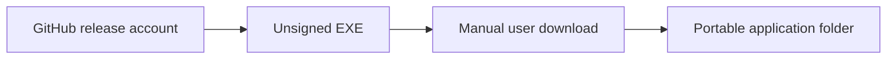
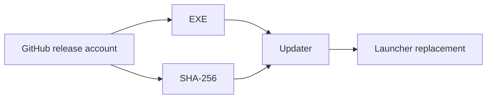
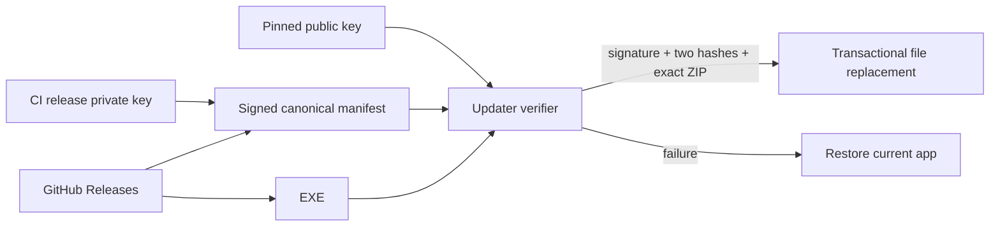

# Security Hardening Proposal: Authenticate Self-Updates Independently Of Transport

## Decision

Choose whether the updater merely detects transfer corruption or independently authenticates the publisher.

## Executive Recommendation

Option 1, **HTTPS plus release hash**, is operationally simple. Option 2, **Pinned signed release manifest**, keeps the private release key outside clients and fails closed. I recommend Option 2.

## Evidence

| Evidence | Finding or document | What it establishes |
| --- | --- | --- |
| `E004` | Standalone updater lifecycle | The application verifies a separate helper, confirms identity through a handshake, then exits so the helper can transactionally replace five files. |
| `E005` | Release workflow | The workflow signs a canonical manifest binding both updater and package. |

I inspected both paths. The compromise scenarios below are threat-model reasoning; no GitHub compromise was observed.

## Current Design And Failure Mode

The original v0.7.0 SFX build demonstrated that a custom self-extracting executable can be indistinguishable from a dropper to Defender ML. A naïve updater that trusts an EXE and hash from the same GitHub publisher account also gives an account compromise authority over both values.

## Desired Invariants

Only a manifest signed by the pinned release key may authorize installation. It binds version plus the exact names, sizes, and SHA-256 hashes of the standalone updater and portable ZIP. The updater independently repeats verification from the immutable versioned release, validates the exact archive, and a failed transaction preserves the current app.

## Constraints And Non-Goals

The app targets .NET Framework 4.8. Authenticode reputation is useful future work but is not required for the updater's cryptographic decision.

## Before Architecture

## Options

### Option 1: HTTPS plus release hash

This option is attractive because it adds only streaming SHA-256 and a manifest. It catches network or storage corruption. It does not separate asset authority from hash authority.

| Change | Before | After | Security consequence | Cost |
| --- | --- | --- | --- | --- |
| Integrity | Manual | Colocated SHA-256 | Detects corruption | Tiny hash cost |

Its rollback is simply disabling checks, but publisher compromise remains unchanged.

### Option 2: Pinned signed release manifest

CI signs a canonical eight-line format-2 manifest. The client embeds only the RSA public parameters, verifies the manifest and updater before launch, and waits for an identity-confirmation handshake. The updater independently verifies the versioned manifest, its own signed hash, the streamed ZIP hash, exact five-file topology, and assembly version. Replacement uses a same-directory transaction backup and reverse-order rollback.

| Change | Before | After | Security consequence | Cost |
| --- | --- | --- | --- | --- |
| Publisher authority | GitHub account | GitHub plus separate release key | Asset substitution alone fails | Key backup/rotation |
| Installation | Manual | Background verified replacement | Partial downloads never replace | One manual bootstrap |

The key operational risk moves to secret custody. A semantically broken signed release is still trusted, so `.previous` and a rollback runbook remain necessary.

## Comparison

| Dimension | Option 1 | Option 2 |
| --- | --- | --- |
| Security | Corruption detection | Independent publisher authentication |
| Performance | Hash | Signature plus hash; both off the UI-critical path |
| Reliability | Reject corrupt bytes | Also verifies archive topology, version, identity handshake, and rollback |
| Operability | Minimal | Key secret, backup, rotation |
| Migration | Simple | Manual updater bootstrap |

## Recommendation

I recommend Option 2. If the project cannot custody the private key reliably, Option 1 plus manual user confirmation is preferable to pretending an unsigned automatic replacement is secure.

## Evidence Coverage And Residual Risk

`E004 — standalone updater lifecycle` enables replacement after the target process identity is confirmed. `E005 — release workflow` is addressed by publishing the package, helper, manifest, and signature together. Compromise of both GitHub authority and the signing key remains residual.

## Migration And Rollout

Provision the secret, publish one manual bootstrap build, then validate bootstrap-to-next update. Keep stable asset names for `releases/latest/download`.

## Validation Plan

Use a known signed fixture; tamper manifest, signature, sizes, hashes, ZIP entries, parent identity, and version; interrupt download and replacement; test unwritable install directories, rollback, and Defender with Internet Zone metadata.

## Implementation Work Packages

Release key provisioning, workflow signing, verified-helper handshake, standalone updater, transactional replacement, cleanup, and release runbook.

## Open Questions

Where is the offline private-key backup, and who is authorized to rotate it?
