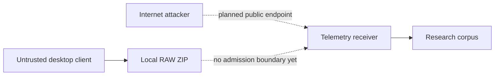
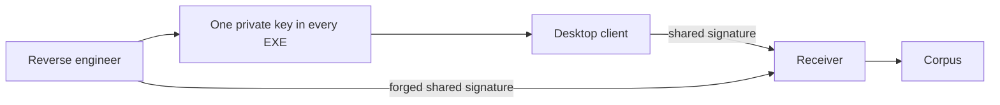
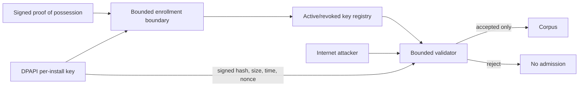

# Security Hardening Proposal: Own The Telemetry-Ingress Trust Boundary

## Decision

Choose how a public desktop client is admitted to a research corpus without pretending the client can attest genuine simulator execution.

## Executive Recommendation

Option 1, **Shared credential in the executable**, is easy but creates one fleet-wide secret. Option 2, **Per-install keys with automatic bounded enrollment**, gives us revocation, replay control, and bounded ingestion without collecting hardware identity or asking users for invitation codes. I recommend Option 2.

## Evidence

| Evidence | Finding or document | What it establishes |
| --- | --- | --- |
| `E001` | Completed RAW chunk boundary | `ChunkCompleted` occurs only after the ZIP is atomically closed. |
| `E002` | Public signed E2E experiment | Enrollment, upload, validation, storage, ACK, and test cleanup worked through Cloudflare. |
| `E003` | Public-client threat model | A common private key in the EXE cannot remain private. |

I inspected the cited client and server paths and ran E002. E003 is an inference from the client ownership boundary, not a claim that a key extraction was performed.

## Current Design And Failure Mode

The v0.6 feature writes local ZIPs. Adding a public receiver makes every byte attacker-controlled. A signature answers “which key sent this,” not “did MSFS generate this.” If every binary shares that key, extraction collapses even the attribution boundary and forces fleet-wide rotation.

## Desired Invariants

Accepted files must be bound to an active installation, signed metadata, fresh nonce, exact hash/size, and strict archive/schema limits. Network failure must not touch the SimConnect callback or silently delete data.

## Constraints And Non-Goals

We do not attempt remote attestation or claim scientific truth from an unreviewed community upload. We do not auto-upload historical RAW directories.

## Before Architecture

The before view shows the missing admission owner.

## Options

### Option 1: Shared credential in the executable

This preserves a small protocol and blocks accidental anonymous requests. Its strongest case is deployment speed. What gives me pause is that the credential's private half must be present on every hostile client; the first extraction becomes global authority.

| Change | Before | After | Security consequence | Cost |
| --- | --- | --- | --- | --- |
| Request gate | None | Shared signature | Stops casual unsigned requests only | Fleet-wide secret rotation |

Rollback is trivial, but that is also evidence that the control owns little.

### Option 2: Per-install keys with automatic bounded enrollment

Each Windows account creates a random installation ID and RSA key, and DPAPI protects the private XML. The server admits the public key after a signed proof-of-possession request, then verifies signed metadata and a replay nonce before streaming the body through strict ZIP and CSV validation. The attractive part is containment: one compromised client is one revocable identity. Since a public client can create arbitrary identities, the server independently caps per-source and global enrollment rate, total registry rows, retained bytes, and free-space reserve.

| Change | Before | After | Security consequence | Cost |
| --- | --- | --- | --- | --- |
| Identity | None/shared | Per installation | Revocation and attribution | Enrollment state |
| Archive handling | Local trusted output | Hostile streamed input | Bounds and validation before admission | CPU and operational ownership |
| Failure handling | Permanent local file | Bounded retry queue | Delete only after ACK | Temporary disk use |

The public E2E supports compatibility, not capacity. We still need realistic 16 MB and concurrent-upload measurements. Rollback stops the isolated Compose stack and leaves client queue files recoverable.

## Comparison

| Dimension | Option 1 | Option 2 |
| --- | --- | --- |
| Security | Fleet-wide extraction failure | Per-install containment; fabricated valid data still possible |
| Performance | One signature | One signature plus bounded validation |
| Reliability | No queue design | Retryable closed-file boundary |
| Operability | Simple until compromise | Registry budgets, revocation, retention, monitoring |
| Migration | Fast | One-time consent/enrollment |

## Recommendation

I recommend Option 2 with automatic enrollment. Community data is explicitly untrusted; server-owned global enrollment and byte budgets, an atomic registry cap, retention, strict validation, and the disk reserve are the Sybil-abuse boundary.

## Evidence Coverage And Residual Risk

`E001 — Completed RAW chunk boundary` is directly used as the queue handoff. `E002 — Public signed E2E` validates the path once. `E003 — Public-client threat model` remains partially residual: an enrolled user can fabricate plausible telemetry.

## Migration And Rollout

Begin with maintainer installs, then enable the public endpoint while monitoring enrollment counts, rejection rates, SQLite/WAL size, corpus bytes, and free space. Do not scan historical `Raw Captures`; only newly completed telemetry queue chunks participate. Rotate the disclosed tunnel token after confirming the replacement.

## Validation Plan

Run malformed ZIP, bomb ratio, wrong schema, NaN, replay, revoked key, duplicate, quota, disconnect, and process-kill cases. Benchmark 1/8/16 MB captures.

## Implementation Work Packages

Client consent/identity/queue, server admission/validation/storage, Docker/Cloudflare deployment, and operator enrollment-budget/revocation/retention runbooks.

## Open Questions

Where will privacy/retention text live publicly, and which monitoring system should receive reject/disk alerts?
